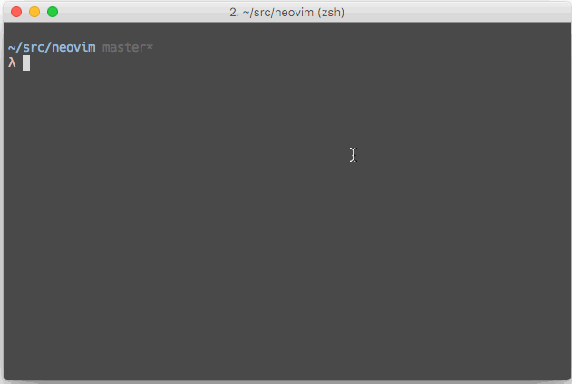

<big><h1 align="center">gpr</h1></big>

<p align="center">
  <a href="https://npmjs.org/package/gpr">
    
  </a>

  <a href="https://coveralls.io/r/dvcrn/gpr">
    
  </a>

  <a href="https://travis-ci.org/dvcrn/gpr">
    
  </a>

  <a href="https://npmjs.org/package/gpr">
    
  </a>

  <a href="https://david-dm.org/dvcrn/gpr.svg">
    
  </a>

  <a href="https://github.com/dvcrn/gpr/blob/master/LICENSE">
    
  </a>
</p>

<p align="center"><big>
a minimal github pull request patcher
</big></p>



## Install

```sh
npm install -g gpr
```

## Usage

navigate into a github managed folder and git `gpr`.

Alternatively pass in the github repository name as the first parameter. Useful when merging upstream changes for example.
```
gpr dvcrn/proton
gpr neovim/neovim
```

## License

MIT © [David Mohl](http://github.com/dvcrn)

[npm-url]: https://npmjs.org/package/gpr
[npm-image]: https://img.shields.io/npm/v/gpr.svg?style=flat-square

[travis-url]: https://travis-ci.org/dvcrn/gpr
[travis-image]: https://img.shields.io/travis/dvcrn/gpr.svg?style=flat-square

[coveralls-url]: https://coveralls.io/r/dvcrn/gpr
[coveralls-image]: https://img.shields.io/coveralls/dvcrn/gpr.svg?style=flat-square

[depstat-url]: https://david-dm.org/dvcrn/gpr
[depstat-image]: https://david-dm.org/dvcrn/gpr.svg?style=flat-square

[download-badge]: http://img.shields.io/npm/dm/gpr.svg?style=flat-square
